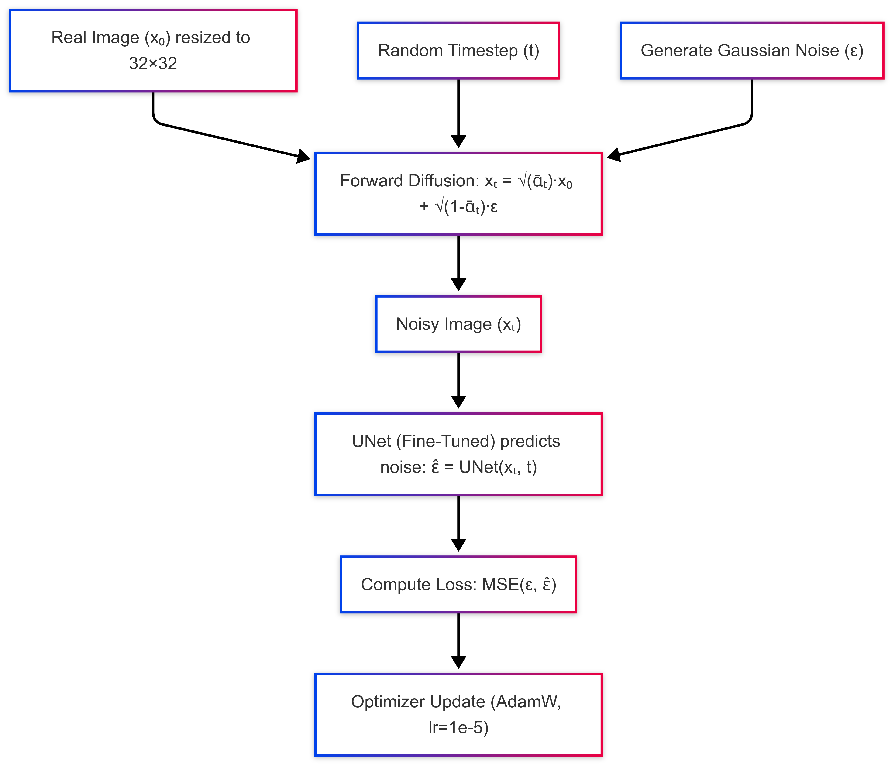
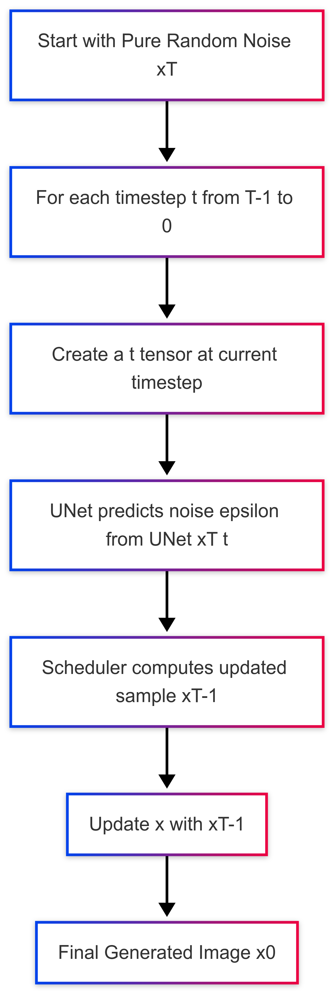
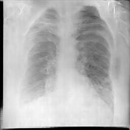
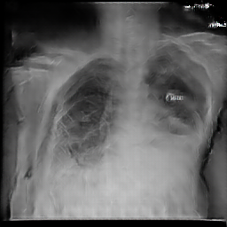
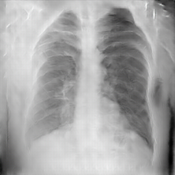
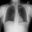
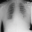
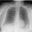

# Synthetic-Medical-Data-Generation

**Author:** Shriya Chepur, MS in Artificial Intelligence  
**Email:** shriyachepur@gmail.con

---

## Table of Contents

1. [Project Overview](#project-overview)
2. [Directory Structure](#directory-structure)
3. [Environment Setup and Dependencies](#environment-setup-and-dependencies)
4. [Data Preparation](#data-preparation)
5. [Training and Testing](#training-and-testing)
6. [Results](#evaluation-and-results)
7. [References and Acknowledgements](#references-and-acknowledgements)

---

## 1. Project Overview

This project aims to generate synthetic chest X-ray images to augment real medical datasets. The project consists of two main components:

- **Baseline GAN Approach:**  
  A Deep Convolutional GAN (DCGAN) is implemented to generate 256×256 synthetic chest X-ray images. This baseline is evaluated using Fréchet Inception Distance (FID) and Inception Score (IS).

- **Core Diffusion Model (DDPM) Approach:**  
  A lightweight Denoising Diffusion Probabilistic Model (DDPM) pre-trained on CIFAR-10 (`google/ddpm-cifar10-32`) is adopted and fine-tuned its UNet on the chest X-ray dataset. The diffusion model works by first corrupting an image with Gaussian noise (forward process) and then learning to reverse this process (reverse diffusion) to generate synthetic images from pure noise.

The ultimate goal is to evaluate how the augmented synthetic dataset affects the performance of downstream classification tasks.

---

## 2. Directory Structure

Directory Hierarchy for the project:

```
Synthetic_Data_Generation/
├── README.md                    # Overview, instructions, and documentation
├── requirements.txt             # List of dependencies and environment requirements
├── data/
│   ├── train_data/              # Training images
│   ├── validation_data/         # Validation images
│   ├── test_data/               # Test images
├── models/                      # Saved gan and ddpm models
├── results/
│   ├── baseline gan results/             # Synthetic images produced by the gan model
│   ├── ddpm results/        # Synthetic images produced by the diffusion model
└── scripts/
    ├── data extraction.py    # Script for data extraction

```


## 3. Environment Setup and Dependencies

### Environment Requirements
- **Python:** 3.8 or higher
- **PyTorch:** Latest stable version (with CUDA support)
- **Torchvision**
- **Diffusers:** Hugging Face Diffusers library

### Installation Instructions
1. Clone the repository:
   ```bash
   git clone https://github.com/shriyachepur/Synthetic-Medical-Data-Generation
   

## Data Preparation
The dataset is a subsection of the NIH Chest X-ray collection. It includes images labeled with either ”infiltration” or ”no finding,” representing two diagnostic categories. The
subset consists of approximately 40,000 images around 20,000 instances for each class, ensuring a class balance.

### Dataset Download and Subset Extraction

- The full NIH Chest X-ray dataset is to be downloaded from the official source (e.g., [NIH Chest X-ray Dataset](https://nihcc.app.box.com/v/ChestXray-NIHCC)).  

### Data Extraction Process

- A script named `data_extraction.py` is provided for extracting a relevant subset of the dataset.  
- The CSV file (`final_data.csv`) containing image labels is used by the script to filter the full dataset.  
- A balanced subset, containing images corresponding to the labels “infiltration” and “no_finding”, is generated and organized into three splits: training, validation, and test.

### Running the Extraction Script

- The extraction script is to be executed from the project root. An example command is shown below:
  ```bash
  python data_extraction.py

## Training and Testing

### GAN Training

- The GAN baseline model was trained using `gan.ipynb`.  
  - Training was performed over 20 epochs with adversarial updates applied to both the generator and the discriminator.  
  - Checkpoint model and sample images were saved after each epoch in the `models/` and `results/baseline_results/` directories, respectively.

### Proposed DDPM Core Algorithm Overview

Denoising Diffusion Probabilistic Models (DDPMs) are a class of generative models that transform pure noise into realistic images through an iterative, learned denoising process. The core algorithm operates in two stages: a forward diffusion process that progressively adds Gaussian noise to an image over many timesteps, and a reverse diffusion process in which a neural network (typically a U-Net) predicts and removes the noise at each timestep. By training the network to minimize the difference between the predicted and the actual noise, the model learns to effectively reverse the corruption, ultimately generating new images from random noise.

<p align="center">
  
  &nbsp;&nbsp;&nbsp;
  
</p>

<p align="center">
  <em><strong>Figure 1:</strong> Fine Tuning</em>
  &nbsp;&nbsp;&nbsp;&nbsp;&nbsp;&nbsp;&nbsp;&nbsp;
  <em><strong>Figure 2:</strong> Image Generation during Diffusion Process</em>
</p>


- The diffusion model (DDPM) was fine-tuned using the script `ddpm.ipynb`.  
  - Chest X-ray images were first resized to 32×32 pixels (to match the pre-trained model input) and normalized to the range [-1, 1].  
  - For each training batch, a random timestep was sampled and Gaussian noise was added according to the forward diffusion process.  
  - The UNet was fine-tuned by minimizing the Mean Squared Error (MSE) between the predicted noise and the actual noise.  
  - The AdamW optimizer with a learning rate of 1×10⁻⁵ was used to update the UNet parameters.  
  - The fine-tuned model was saved in `models/`.

### Testing

## Results

### Synthetic Images from the GAN Baseline
Below are sample synthetic chest X-ray images generated by the GAN baseline:

|  |  |  |
| --- | --- | --- |


### Synthetic Images from the Diffusion Model (DDPM)
Below are sample synthetic chest X-ray images generated by the fine-tuned diffusion model:
|  |  |  |
| --- | --- | --- |


## References

1. Goodfellow, I. J., Pouget-Abadie, J., Mirza, M., Xu, B., Warde-Farley, D., Ozair, S., Courville, A., & Bengio, Y. (2014). *Generative Adversarial Nets*. Advances in Neural Information Processing Systems (NeurIPS). [Link](https://papers.nips.cc/paper/5423-generative-adversarial-nets.pdf)

2. Ho, J., Jain, A., & Abbeel, P. (2020). *Denoising Diffusion Probabilistic Models*. Advances in Neural Information Processing Systems (NeurIPS). [Link](https://arxiv.org/abs/2006.11239)

3. NIH Chest X-ray Collection. Retrieved from the National Institutes of Health website. [Link](https://nihcc.app.box.com/v/ChestXray-NIHCC)

4. Heusel, M., Ramsauer, H., Unterthiner, T., Nessler, B., & Hochreiter, S. (2017). *GANs trained by a two time-scale update rule converge to a local Nash equilibrium*. Advances in Neural Information Processing Systems (NeurIPS). [Link](https://papers.nips.cc/paper/7203-gans-trained-by-a-two-time-scale-update-rule-converge-to-a-local-nash-equilibrium.pdf)

5. Salimans, T., Goodfellow, I., Zaremba, W., Cheung, V., Radford, A., & Chen, X. (2016). *Improved Techniques for Training GANs*. Advances in Neural Information Processing Systems (NeurIPS). [Link](https://arxiv.org/abs/1606.03498)


